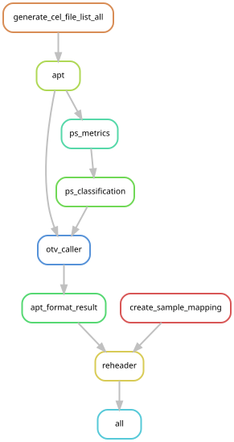

# Genotyping

This workflow creates a VCF file based on the SNP microarray data in a set of `.CEL` files.
This VCF file can be used for demultiplexing 10X scRNA-seq data where multiple samples have been "pooled" and captured together.

## Authors

This workflow was originally developed by [@nbartonicek](https://github.com/nbartonicek) as a collection of bash and SGE scripts.
These scripts were then refactored as part of the Swarbrick Lab [souporcell workflow](https://git.gimr.garvan.org.au/CTP/soup-or-cell) (VPN required) by [@dlroden](https://github.com/dlroden), as an extension of the [original souporcell workflow](https://github.com/wheaton5/souporcell) by [@wheaton5](https://github.com/wheaton5) et al.
Parts of the Swarbrick Lab souporcell workflow were then transferred to the Swarbrick Lab [demuxafy workflow](https://github.com/swarbricklab/demuxafy) by [@dlroden](https://github.com/dlroden) and [@BeataKiedik](https://github.com/BeataKiedik), as an extension of the [original demuxafy workflow](https://github.com/drneavin/Demultiplexing_Doublet_Detecting_Docs) by [@drneavin](https://github.com/drneavin).
Finally, the genotyping steps in the Swarbrick Lab demuxafy workflow were extracted and refactored as a standalone workflow (this repo) by @johnyaku.

## Overview

SNP microarray data is stored in `.CEL` files, with one `.CEL` file per sample, as defined in a sample sheet.
This workflow uses the [Analysis Power Tools](https://www.thermofisher.com/au/en/home/life-science/microarray-analysis/microarray-analysis-partners-programs/affymetrix-developers-network/affymetrix-power-tools.html) (APT) by ThermoFisher Scientific to convert these `.CEL` files into a single VCF file containing high-confidence variant calls for all samples.
Annotation of the VCF file is based on [this annotation reference](https://www.thermofisher.com/order/catalog/product/901153?SID=srch-srp-901153) (also by ThermoFisher Scientific), which in turn is based on the `hg19` assembly of the human genome. 
This worklow formats the VCF file by adding header contigs for `hg19` and reformatting the chomosome names from 1, 2, 3, ... to chr1, chr2, chr3, ...
Finally, the formatted `hg19` VCF file is lifted over to the `hg38` assembly.

The workflow, defined by the [Snakefile](workflow/Snakefile) runs as shown by the following rule graph:



See the individual rule definitions to understand the function of each rule.

Further reading: [Axiom Genotyping Solution Data Analysis User Guide](https://assets.thermofisher.com/TFS-Assets/LSG/manuals/axiom_genotyping_solution_analysis_guide.pdf)

## Configuration

Configuring the workflow involves editing two files:
- config file (see [this template](config/template.yaml) for an example)
- sample sheet (see [this example](config/samples.csv) used for testing)

### Config file

To use this workflow as a module in a super-project, first copy the template config file from the module to the super project:
```
cd top/of/superproject
mkdir -p config/genotyping
cp modules/genotyping/config/template.yaml config/genotyping/config.yaml
```
(*) This assumes that this workflow module has been installed to `modules/genotyping`.

Next, check the paths in the config file and edit if needed. 
In many cases, the template can be left unchanged.
Refer to the comments in the template for the meaning for each item.

### Sample sheet

The sample sheet is a CSV file with the following columns:
- sample
- cel_files
- array_type

These column names are fixed, but additional columns can be added if desired.
See [this example](config/samples.csv).

The meanings of each column are as follows:

| Column | Meaning |
|--------|---------|
| sample | The sample id to use in the VCF header |
| cel_files | The path to the .CEL file for each sample, relative to the top of the super project |
| array_type | Either 'UKB' or 'PMDA' |

Here 'UKB' refers to the [UK Biobank Array](https://www.thermofisher.com/order/catalog/product/902502),while 'PMDA' refers to the [Axiom Precision Medicine Diversity Array](https://www.thermofisher.com/order/catalog/product/951962?SID=srch-srp-951962).

Make sure that the path to the sample sheet is specfied correctly in the config file.

